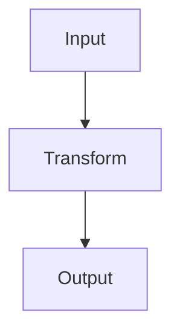

# Markdown Instructions

## 1. Scope

Apply these instructions when editing:

* Markdown files (`*.md`)
* Agent instruction files
* Skill files such as `SKILL.md`
* README files
* Documentation files
* Plan files under `.agents/plans/`

## 2. General Style

* Write clear, structured Markdown.
* Use concise headings.
* Prefer short sections over long dense blocks.
* Use bullet lists for procedures, requirements, and checklists.
* Use tables only when they make comparison easier.
* Use Mermaid diagrams as the default format for process flow, data flow, control flow, state transition, and component relationship descriptions.
* Do not represent structured flows with plain `text` code blocks and arrows when Mermaid can express the same information clearly.
* Keep code fences language-tagged when possible.
* Avoid vague wording in agent-facing instructions.
* Keep instructions actionable and testable.
* Avoid duplicating the same rule in multiple places unless required for tool compatibility.

## 3. Language Policy

* Write agent-facing instructions in English.
* Write user-facing documentation in the language used by the surrounding documentation.
* When documentation is primarily Japanese, use natural Japanese.
* Do not mix Japanese and English in the same sentence unless technical terms make it necessary.
* Keep code identifiers, command names, file paths, and tool names unchanged.

## 4. Agent-Facing Markdown

For files such as `AGENTS.md`, `.agents/instructions/*.md`, and `SKILL.md`:

* Prefer direct imperative wording.
* Avoid ambiguous words such as "basically", "maybe", "probably", and "as needed" unless the condition is clearly defined.
* Keep always-loaded files concise.
* Move detailed language-specific or task-specific guidance to separate instruction or skill files.
* Do not include secrets, private URLs, or machine-specific local paths.
* Do not include tool-specific syntax in shared instructions unless it is intentionally shared.

## 5. Diagrams and Flow Expressions

When a Markdown file describes a process, data flow, control flow, state transition, sequence interaction, component relationship, or dependency relationship, use Mermaid first.

Use Mermaid for structured flow expressions such as:

* `A -> B -> C`
* `input -> transform -> output`
* `request -> handler -> service -> database`
* `state A -> state B`
* `component A depends on component B`

Do not use plain `text` code blocks as pseudo-diagrams for these cases.

Use fenced Mermaid code blocks:

Prefer Mermaid diagram types according to the topic:

* Use `flowchart` for process flows, data flows, control flows, and component relationships.
* Use `sequenceDiagram` for interactions between actors, services, tools, or processes over time.
* Use `stateDiagram-v2` for state transitions.
* Use `classDiagram` or `erDiagram` only when they clearly improve structural understanding.

When adding Mermaid diagrams:

* Keep diagrams small enough to review easily.
* Add a short explanation before or after the diagram when the intent is not obvious.
* Prefer Mermaid diagrams over ASCII art or arrow-based text diagrams for structured flows.
* Do not use Mermaid when a short bullet list or table is clearer.
* Use `text` code blocks only for literal text, command output, logs, or examples where the exact plain-text format matters.

## 6. Plan Files

Plan files under `.agents/plans/` must be specific enough for review before implementation.

A plan file should include:

* goal
* current understanding
* files likely to change
* proposed steps
* validation plan
* risks and considerations
* acceptance criteria

Use Mermaid diagrams in plan files when they clarify the planned process, data flow, control flow, state transition, or affected component relationships.

Do not use plan files to hide implementation details after the fact. If implementation diverges from the plan, add an `Implementation Notes` section.

## 7. Links and References

* Prefer relative links for repository files.
* Keep external links stable and relevant.
* Do not add raw URLs when a readable Markdown link is clearer.
* Check whether linked files or headings exist when practical.
* Do not invent references.

## 8. Code Blocks

* Use fenced code blocks.
* Add a language tag such as `python`, `bash`, `text`, `toml`, `markdown`, or `mermaid` when practical.
* Use `mermaid` code blocks for structured flow diagrams.
* Do not use `text` code blocks for arrow-based pseudo-diagrams when Mermaid is practical.
* Ensure commands are copy-pasteable when shown as commands.
* Avoid mixing command output and commands in the same code block unless clearly labeled.

## 9. Checklist

Before finishing Markdown changes, confirm:

* [ ] The Markdown structure is clear.
* [ ] Headings and lists are consistent.
* [ ] Code fences have language tags where practical.
* [ ] Mermaid diagrams are used for process flows, data flows, control flows, state transitions, sequence interactions, component relationships, or dependency relationships when they improve clarity.
* [ ] Plain `text` code blocks are not used as arrow-based pseudo-diagrams when Mermaid is practical.
* [ ] Links are valid or reasonably checked.
* [ ] Agent-facing instructions are concise and actionable.
* [ ] No secrets or machine-specific local paths were added.
