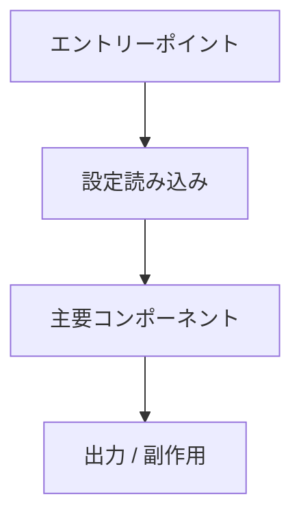

# リポジトリ概要レポート

## 1. エグゼクティブサマリー

このリポジトリが何をするものか、どのような種類のプロジェクトかを簡潔に説明する。

## 2. リポジトリの目的

| 項目 | 概要 |
| --- | --- |
| 主な目的 | |
| 主な利用者 | |
| 主なランタイム / フレームワーク | |
| 主な言語 | |
| パッケージ / アプリケーション種別 | |

## 3. リポジトリ構成

| パス | 役割 | メモ |
| --- | --- | --- |
| `README.md` | | |
| `src/` | | |
| `tests/` | | |
| `docs/` | | |

## 4. 主な実装領域

最も重要な実装領域を要約する。

| 領域 | 主要パス | 責務 |
| --- | --- | --- |
| | | |

## 5. ランタイム / 実行フロー

エントリーポイントから主な挙動までの大まかな流れを説明する。

## 6. 設定とツール

| 目的                  | 信頼できる情報源 | メモ |
| --------------------- | --------------- | ----- |
| 依存関係              |                 |       |
| ビルド                |                 |       |
| 実行                  |                 |       |
| テスト                |                 |       |
| lint                  |                 |       |
| フォーマット          |                 |       |
| 型チェック            |                 |       |
| CI                    |                 |       |
| Docker / devcontainer |                 |       |

## 7. 重要なコマンド

| 目的                       | コマンド | 出典 | メモ |
| ------------------------ | ------- | ------ | ----- |
| 依存関係のインストール    |         |        |       |
| テスト実行                |         |        |       |
| lint 実行                 |         |        |       |
| フォーマッター実行        |         |        |       |
| 型チェック実行            |         |        |       |
| パッケージ / 成果物ビルド |         |        |       |

## 8. テストと品質戦略

次を要約する:

* テストフレームワーク
* テストディレクトリ構成
* fixture または helper のパターン
* CI 検証
* 不足または不明なテスト領域

## 9. ドキュメントの状態

次を要約する:

* README の正確性
* セットアップ手順
* 使用例
* 開発手順
* 古い、または不足しているドキュメント

## 10. リスクと不明点

| 種別    | 項目 | 影響 | 推奨フォローアップ |
| ------- | ---- | ------ | ------------------- |
| 不明    |      |        |                     |
| リスク  |      |        |                     |

## 11. 推奨される次の手順

今後の coding agent またはメンテナーに向けて、具体的な次の手順を列挙する。

1.
2.
3.

## 12. 根拠

重要な根拠を記録する。

| 根拠                       | 重要な理由 |
| -------------------------- | -------------- |
| `path/to/file`             |                |
| `path/to/file:symbol_name` |                |
| コマンド結果               |                |
