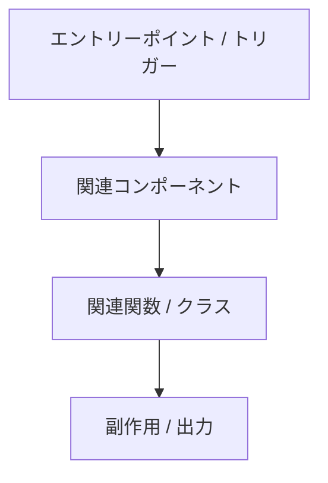

# 対象リポジトリ調査レポート

## 1. 調査トピック

| 項目 | 値 |
| --- | --- |
| トピック | |
| 調査種別 | |
| ユーザー質問 | |
| レポートパス | |
| ステータス | 下書き / 検証済み / 要追加対応 |

## 2. 直接の結論

最も重要な結論を先に記載する。

## 3. スコープ

### 含むもの

* 

### 含まないもの

* 

## 4. 関連ファイルとシンボル

| パス | シンボル / キー / コマンド | 関連性 |
| --- | --- | --- |
| | | |

## 5. 調査結果

### 調査結果 1

**結論:**

**根拠:**

**メモ:**

### 調査結果 2

**結論:**

**根拠:**

**メモ:**

## 6. 挙動 / フロー

トピックが実行時の挙動に関わる場合に使う。

## 7. 影響範囲

トピックが潜在的な変更に関わる場合に使う。

| 領域 | 影響 | リスク | ファイル / テスト |
| ---- | ------ | ---- | ------------- |
|      |        |      |               |

## 8. 関連テストと検証

| 目的 | コマンドまたはテスト | 出典 | メモ |
| ------- | --------------- | ------ | ----- |
|         |                 |        |       |

## 9. 不明点と前提

| 種別       | 項目 | フォローアップ |
| ---------- | ---- | --------- |
| 前提       |      |           |
| 不明       |      |           |

## 10. 推奨される次の手順

1.
2.
3.

## 11. 根拠ログ

| 根拠                       | 重要な理由 |
| -------------------------- | -------------- |
| `path/to/file`             |                |
| `path/to/file:symbol_name` |                |
| コマンド結果               |                |

## 12. 委任ログ

委任が必須だった場合、試行された場合、または環境制約でスキップされた場合のみ使う。

| 役割 | 委任 | 結果を使用 | メモ |
| ---- | --------- | ----------- | ----- |
| | | | |
